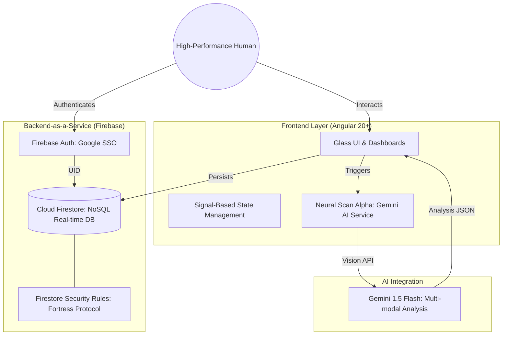

# FlexFlow Protocol: Project Overview & Architecture

**Architect & Founder:** Guru_Raj_N
**Version:** 2.5.0
**Status:** Operational (Neural Scan Alpha Integrated)

---

## 1. Project Mission
FlexFlow is a high-performance fitness and nutrition tracking ecosystem designed for seamless optimization of human performance. It leverages AI-driven visual analysis (Gemini 3.0) and a real-time cloud backbone (Firebase) to eliminate friction in data logging.

---

## 2. System Architecture

---

## 3. Data Schema (Core Entities)

### UserProfile
*   **Collection:** `profiles/{uid}`
*   **Fields:**
    *   `uid`: String (Primary Key)
    *   `displayName`: String
    *   `dailyCalorieGoal`: Number (kcal)
    *   `dailyProteinGoal`: Number (g)
    *   `weight`: Number (kg)
    *   `height`: Number (cm)
    *   `age`: Number (years)
    *   `gender`: Enum (male, female, other)
    *   `activityLevel`: Enum (sedentary, light, moderate, active, very_active)
    *   `updatedAt`: Timestamp

### MealLog
*   **Collection:** `meals`
*   **Fields:**
    *   `userId`: String (Owner)
    *   `date`: String (YYYY-MM-DD)
    *   `name`: String
    *   `calories`: Number
    *   `protein`: Number
    *   `carbs`: Number
    *   `fats`: Number
    *   `createdAt`: Timestamp

### WorkoutSession
*   **Collection:** `workouts`
*   **Fields:**
    *   `userId`: String
    *   `date`: String
    *   `name`: String
    *   `sets`: Number
    *   `reps`: Number
    *   `weightLifted`: Number
    *   `caloriesBurned`: Number
    *   `duration`: Number
    *   `createdAt`: Timestamp

---

## 4. Operational Protocols

### Authentication Protocol
*   **Operation:** `login()`
*   **Mechanism:** Single Sign-On (SSO) via Google Identity. Pop-up based authentication.
*   **State:** Persisted via Firebase Auth listeners.

### Nutrition Protocol (The "Neural Scan")
*   **Operation:** `analyzeMeal()`
*   **Mechanism:** Dual-path input (Visual or Text). Images are processed by Gemini to extract macro-nutrients and caloric density without manual user calculation.
*   **Manual Override:** `manualLog()` allows high-precision manual data entry when standard scanner protocols are bypassed.

### Physical Optimization Protocol
*   **Operation:** `createWorkout()`
*   **Mechanism:** Logs session metadata (volume, intensity, duration). Integrated with the global training dashboard.

### Trend Analysis Protocol
*   **Operation:** `logWeight()`
*   **Mechanism:** Daily weight snapshots creating a visual progression timeline. 

---

## 5. Security & Isolation
Data is protected by the **Fortress Security Protocol** (Firestore Rules):
1.  **Identity Lock:** Users can only read/write documents where `userId == request.auth.uid`.
2.  **Schema Validation:** All writes are validated against internal schemas to prevent "Denial of Wallet" and data corruption.
3.  **PII Isolation:** User metadata is strictly separated from anonymized telemetry.

---
*© 2026 FlexFlow Protocol // Architect: Guru_Raj_N*
